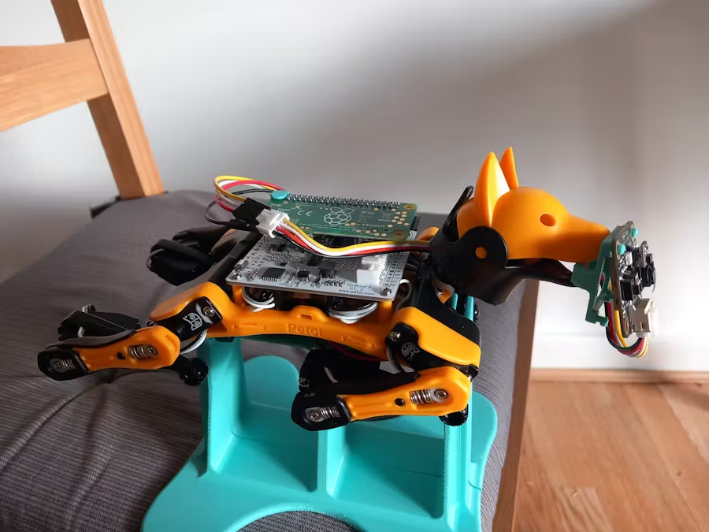
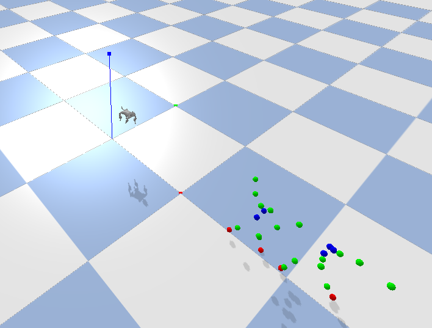
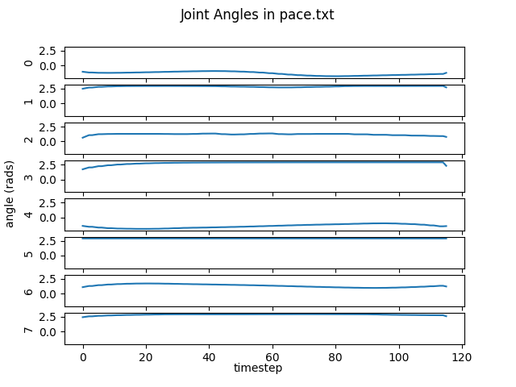
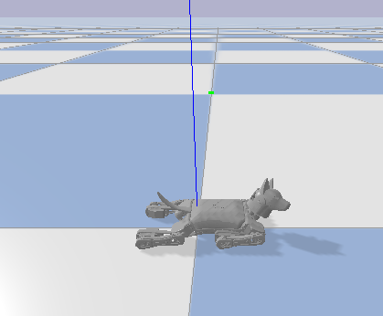

# quadruped_learning

## Motion re-targeting
We took an existing URDF file that was newly published by Petoi, the makers of the Bittle robot, and modified it to work in pybullet. Original file [here](https://github.com/PetoiCamp/ros_opencat). Modified file [here](./bittle/bittle_petoi.urdf).

We then leveraged tools from "Learning Agile Robotic Locomotion Skills by Imitating Animals", by Xue Bin Peng et al. [here](https://github.com/erwincoumans/motion_imitation/) to fit motions to our robot model and get a sequence of poses. We saved the poses [here](./data_retargetted_motion/). A description of this method is below:

For retargeting the root orientation and position, we simply calculate orientation using pelvis, neck, shoulder, and hip locations in the reference motion. We take position by using pelvis and neck position. For joint angles, we first calculate target toe positions. Then we then use pybullet to calculate inverse kinematics to match all the toe positions.

## Simulation Environments
We made a simulation environment for pybullet that let's you set target angles and step time forward for our bittle model, [here](./motion_learning/env.py).

We also made a version of this simulation environment that plugs in [tensorflow-agents](https://www.tensorflow.org/agents/tutorials/2_environments_tutorial) and their API [here](./motion_learning/tensorflow_env.py)

