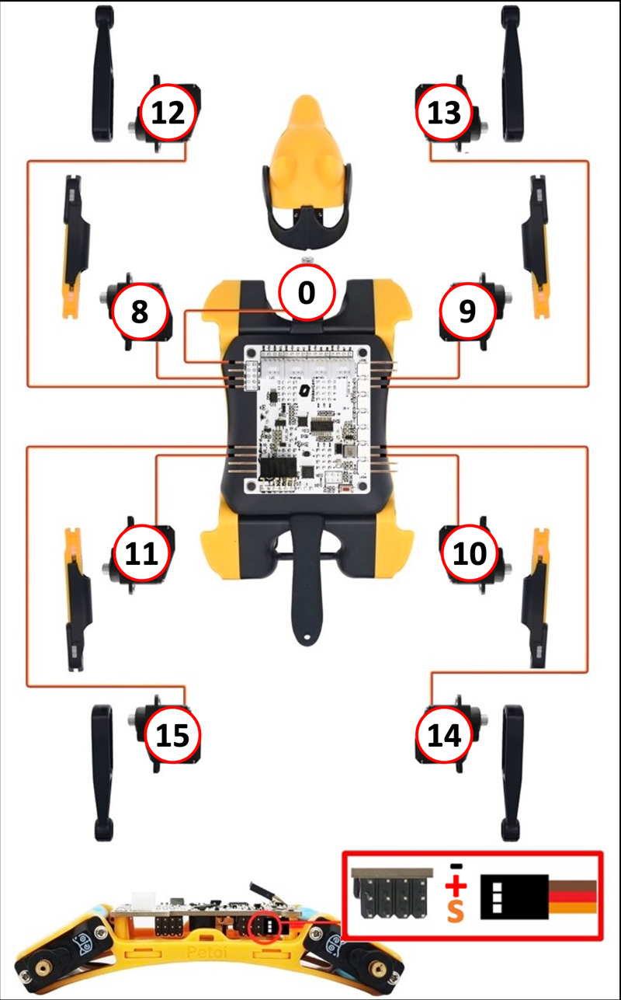

docker build -t bittle:2024-6-15 -f .\Dockerfile --progress=plain .

# setting up the bittle
on the Nyboard, on the side of the board facing the robot there is a switch. This switch should be toward the Bittle's head to be raspberry pi as i2cm aster.

i2cdetect -y 1

sudo docker run -it --device /dev/i2c-1 mzandtheraspberrypi/bittle:2024-6-15

# setting up the pi
1. Ensure that the line enable_uart=1 is uncommented in the /boot/firmware/config.txt file, it should be by default.
2. remove any reference to console in /boot/firmware/cmdline.txt, ie remove console=serial0,115200.
3. disable the serial console `sudo systemctl stop serial-getty@ttyS0.service && sudo systemctl disable serial-getty@ttyS0.service`
4. change i2c to operate at 400khz instead of the default 100khz. This will help our i2c master clock go faster and let us push more data through.
5. install docker and other stuff by running `setup_pi.sh` in this repo and then rebooting the pi with something like `sudo reboot`.
6. if you will use lot's of memory, allocate a swap file, in ubuntu for example:  
```
sudo fallocate -l 512M /swapfile
sudo chmod 600 /swapfile
sudo mkswap /swapfile
sudo swapon /swapfile
sudo swapon --show
echo '/swapfile none swap sw 0 0' | sudo tee -a /etc/fstab
sudo sysctl vm.swappiness=2
sudo reboot
sudo swapon --show
```

# notes on the bittle joint angles
I installed my servos as per the Bittle setup instructions, with Nyboard v1.2. The installation directions are below, note that the numbers here do not correspond to PCA9685 pin numbers:  


When I tested my setup which is a Bittle with metal geared servos, Nyboard v1.2, I found the following joint/PCA9685 pin mappings:  
|joint_name|PCA9685_pin_num|direction_notes|
|---|---|---|
|back_left_knee|0|increasing pwm moves the foot towards body|
|back_left_shoulder|1|increasing pwm moves the knee away from body|
|back_right_shoulder|6|increasing pwm moves the knee toward the body|
|back_right_knee|7|increasing the pwm moves the foot away from body|
|front_right_knee|8|increasing the pwm moves the foot toward the body|
|front_right_shoulder|9|increasing the pwm moves the foot toward the body|
|front_left_shoulder|14|increasing the pwm moves the knee toward the body|
|front_left_knee|15|increasing the pwm moves the foot away from the body|
|head_joint|12|increasing the pwm moves the head to the left|

How does the Bittle command a joint to a certain angle? Often with these servos they are controlled by how long a pulse is held high, in microseconds. Servos typically have a range of 180 degrees, and a pulse of 1000 microseconds high may correspond to 0, 1500 to 90 degrees, and 2000 to 180 degrees. The Bittle's servos have 270 degrees of motion, and 500-2500 microsecond pulse range. However, this microseconds is a bit tricky because with the PCA9685, we actually control them with a 4096 step signal. How many steps the signal is high determines the angle. This takes into account that we could be running the servos at different frequencies, where the 4096 step signal may happen X number of times per second.

The Bittle complicates this slightly. In the Bittle's coordinate system 0 degrees rotation means the shoulders are perpendicular to the ground, and the knees are parallel to the ground. In servo terms this does not correspond to a 1500 microsecond pulse, or the mid point of the 4096 step signal. We install the servos into the Bittle with some offset to allow for different ranges of motion for each joint. 


## Printing Arduino's EEPROM
https://docs.petoi.com/arduino-ide/upload-sketch-for-nyboard
https://github.com/PetoiCamp/OpenCat

I uploaded a script that waits for some message on the serial port and then prints out the eeprom. However, while trying to revert
this I bricked the robot and had to flash the bootloader, then the not main module and do calibrations, then the main module. Then
it worked again.

For convenience I included a dump of the arduino memory in this directory, `arduino_eeprom.txt` so that others don't have to risk this. Note that some values will change for your bittle, like servo calibration.

```c++
...
#define OTHER_MODULES  //uncomment this line to disable the gyroscope code to save programming resources for other modules.
...
void setup() {
  Serial.begin(BAUD_RATE);
  Serial.setTimeout(SERIAL_TIMEOUT);
  while (!Serial.available()) {delay(50);};
  printEEPROM();
  // while (Serial.available() && Serial.read());  // empty buffer

  // join I2C bus (I2Cdev library doesn't do this automatically)
  //#if I2CDEV_IMPLEMENTATION == I2CDEV_ARDUINO_WIRE
  Wire.begin();
  //  TWBR = 24; // 400kHz I2C clock (200kHz if CPU is 8MHz)
  Wire.setClock(500000L);
  //#elif I2CDEV_IMPLEMENTATION == I2CDEV_BUILTIN_FASTWIRE
  //  Fastwire::setup(400, true);
  //#endif
  initRobot();
}
...
```
## Bittle Version
Using commit: 51aae6b197cb2809d1d57c4e798f692b62456d76